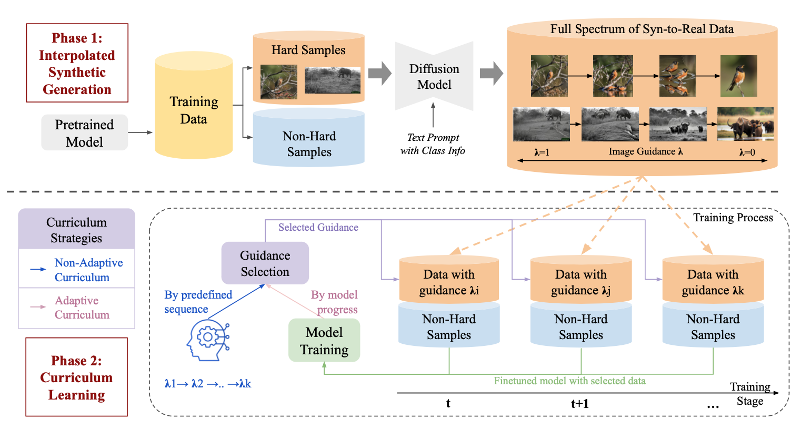
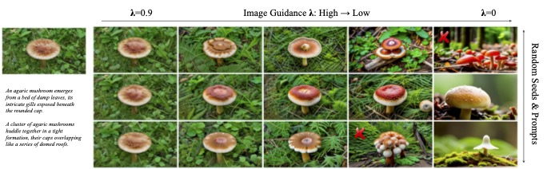
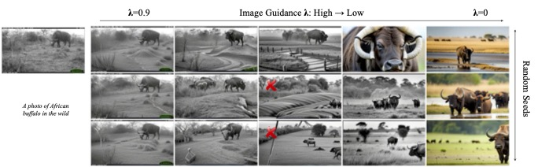
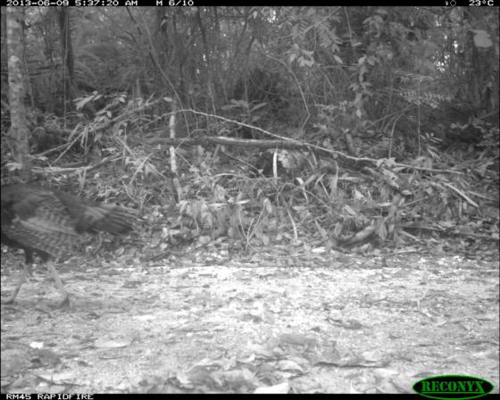
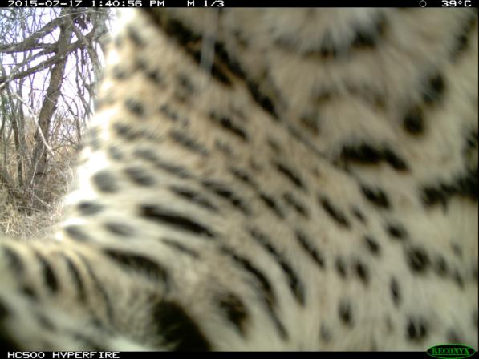
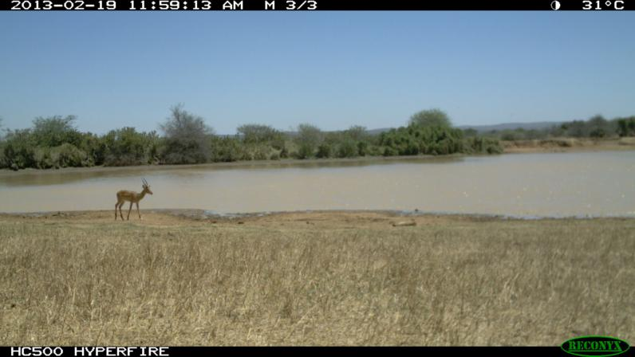
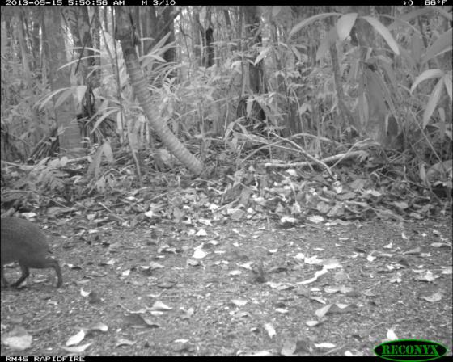
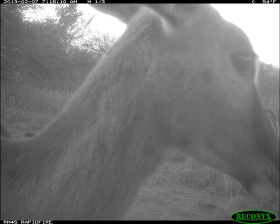

# Diffusion Curriculum (DisCL): Synthetic-to-Real Generative Curriculum Learning via Image-Guided Diffusion [ICCV 2025]

[**📖 Paper**](https://arxiv.org/abs/2410.13674) | [**🪧 Project**](https://joliang17.github.io/DisCL/)

## Overview

<p align="center">
   
</p>

Our approach is composed of two phases: (Phase 1) Interpolated Synthetic Generation and (Phase 2) Training with CL. In
Phase 1, we use a model pretrained on the original data to identify the ''hard'' samples, and generate data with a full
spectrum from synthetic to real images with various image guidance $\lambda$. In Phase 2, utilizing this full spectrum
of data, we design a curriculum strategy (Non-Adaptive or Adaptive), depending on the task. According to the selected
strategy, image guidance is selected at each training stage. Synthetic data generated with selected guidance is then
combined with real data of non-hard samples for training task-model.

## Demo

A [demo script](data_generation/DisCL_demo.ipynb) is prepared for synthetic data generation and filtering.

## Main Results

### Synthetic Images

Synthetic images generated based on ImageNet-LT dataset with DisCL:
<p align="center">
   
</p>

Synthetic images generated based on iWildCam dataset with DisCL:
<p align="center">
   
</p>

### Qualitative Results

Leveraging the full spectrum of synthetic data generated by DisCL, the model performs better on more challenging
samples. Below are improved samples from the iWildCam test set compared to the SOTA method (FLYP).

<p align="center">
  
  
  
  
  
</p>

### Quantitative Results

Top-1 Accuracy on ImageNet-LT:

| Method         | Many  | Medium | Few       | Overall   |
|----------------|-------|--------|-----------|-----------|
| CE             | 57.70 | 26.60  | 4.40      | 35.80     |
| CE + CUDA      | 57.49 | 28.16  | 6.58      | 36.30     |
| CE + **DisCL** | 56.78 | 30.73  | **23.64** | **39.82** |
| BS             | 51.14 | 37.02  | 19.29     | 39.80     |
| BS + CUDA      | 51.16 | 37.35  | 19.28     | 40.03     |
| BS + **DisCL** | 52.68 | 37.68  | **21.36** | **41.33** |

F1 score on iWildCam (OOD: Out-of-domain, ID: In-domain):

| Method           | OOD F1 Score   | ID F1 Score    |
|------------------|----------------|----------------|
| FLYP             | 35.5 (1.1)     | 52.2 (0.6)     |
| FLYP + ALIA      | 36.9 (0.3)     | 52.6 (0.4)     |
| FLYP + **DisCL** | **38.2** (0.5) | **54.3** (1.4) |

## Installation

```shell
conda create -n DisCL python=3.10
conda activate DisCL
pip3 install open_clip_torch
pip3 install wilds
pip3 install -r requirements.txt
```

## Dataset

We use two public datasets for training : ImageNet-LT and iWildCam.

- ImageNet-LT is a long-tailed subset of [ImageNet](https://image-net.org/download.php) data. Long-tailed meta
  information could be download
  from [google drive](https://drive.google.com/drive/folders/19cl6GK5B3p5CxzVBy5i4cWSmBy9-rT_-).
- iWildCam is a image classification dataset captured by wildlife camera trap. It is release by WILDS and can be
  downloaded with its offical [package](https://github.com/p-lambda/wilds/tree/main).

## Code for Synthetic Data Generation

### iWildCam

1. Prepare for a data csv file including hard samples
    - Template of the csv file is shown in file [sample.csv](data_generation/iWildCam/sample.csv)
2. Use this csv to generate synthetic data with guidance scales & random seeds
    ```shell
    python3 data_generation/iWildCam/gene_img.py --part=1 --total_parts=1 --data_csv="${PATH_TO_CSV}" --output_path="${OUTPUT_FOLDER}"
    ```
3. Compute CLIPScore for filtering out poor-quality images.
    ```shell
    python3 data_generation/iWildCam/comp_clip_scores.py --syn_path="${OUTPUT_FOLDER}" --real_path="${PATH_TO_WILDS}"
    ```
    - Results 1 (clip_score.pkl): including the image-image similarity score and image-text similarity score
    - Results 2 (filtered_results.pkl): including only the filtered image-image similarity score and image-text
      similarity score

### ImageNet-LT

1. Prepare for a data csv file including hard samples
    - Template of the csv file is shown in file [sample.csv](data_generation/ImageNet_LT/sample.csv)
2. Use this csv to generate diversified text prompt for hard classes
    ```shell
    python3 data_generation/ImageNet_LT/get_text_prompt.py --data_csv="${PATH_TO_CSV}" --prompt_json="${PATH_TO_PROMPT}" 
    ```
3. Use this csv to generate synthetic data with guidance scales & random seeds
    ```shell
    python3 data_generation/ImageNet_LT/gene_img.py --part=1 --total_parts=1 --data_csv="${PATH_TO_CSV}" --output_path="${OUTPUT_FOLDER}" --prompt_json="${PATH_TO_PROMPT}" 
    ```
4. Compute CLIPScore for filtering out poor-quality images. This script will produce a clip_score.pkl including the
   image-image similarity score and image-text similarity score
    ```shell
    python3 data_generation/ImageNet_LT/comp_clip_scores.py --syn_path="${OUTPUT_FOLDER}" --real_path="${PATH_TO_INLT}"
    ```
    - Results 1 (clip_score.pkl): including the image-image similarity score and image-text similarity score
    - Results 2 (filtered_results.pkl): including only the filtered image-image similarity score and image-text
      similarity score

## Code for Curriculum Learning

### For ImageNet-LT

- Run training scripts [run_training.sh](curriculum_training/ImageNet/myshells/run_training.sh)
   ```shell
   cd curriculum_training/ImageNet
   bash myshells/run_training.sh
   ```
### For iWildCam

- Run training scripts [run_training.sh](curriculum_training/iWildCam/myshells/run_training.sh)
   ```shell
   cd curriculum_training/iWildCam
   bash myshells/run_training.sh
   ```

## Acknowledgement

Our code is heavily based
on [FLYP](https://github.com/locuslab/FLYP), [LDMLR](https://github.com/AlvinHan123/LDMLR/tree/main),
and [Open CLIP](https://github.com/mlfoundations/open_clip). We greatly thank the authors for open-sourcing their code!

## Citation

Please consider citing our paper if you think our codes, data, or models are useful. Thank you! <br>

```
@inproceedings{liang-bhardwaj-zhou-2024-discl,
    title = "Diffusion Curriculum: Synthetic-to-Real Generative Curriculum Learning via Image-Guided Diffusion",
    author = "Liang, Yijun and Bhardwaj, Shweta and Zhou, Tianyi",
    booktitle = "International Conference on Computer Vision (ICCV)",
    year = "2025",
}
```
